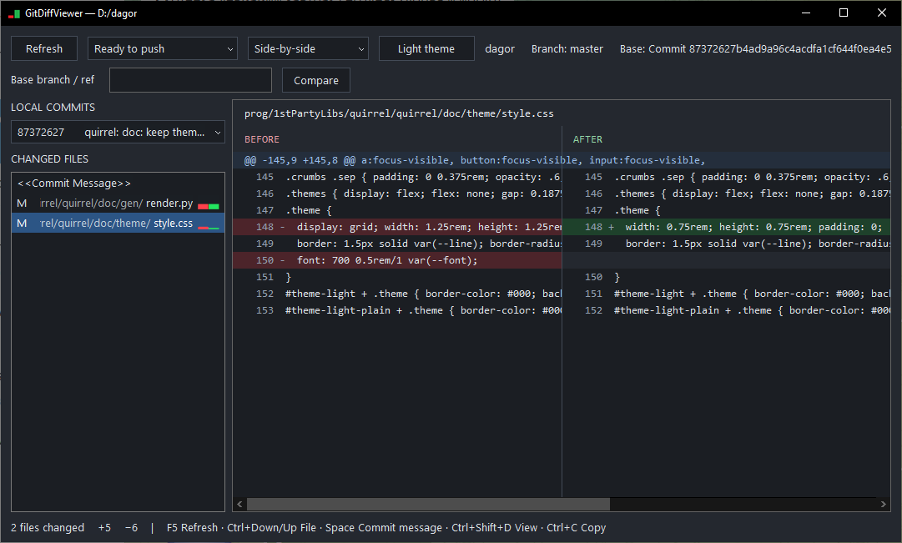

# GitDiffViewer

GitDiffViewer is a native Windows application for reviewing local Git changes. It builds as **`gfd.exe`** and provides unified and side-by-side diffs in a lightweight Win32 interface.



The application uses the installed Git command-line client to read repository data. It does not edit files, stage changes, create commits, or run fetch, pull, or push.

## Features

- Review staged changes, unstaged changes, all local changes, repository history, individual commits, and comparisons between refs.
- Inspect local commits relative to an upstream or an explicitly selected base branch.
- Switch between unified and side-by-side layouts without reloading Git data, while preserving the current viewing position.
- Display line numbers, added and removed lines, file statuses, renames, and binary-file notices.
- Read full commit messages, or preview them by hovering over entries in the local commit dropdown.
- Browse Unicode paths and text, with virtualized diff rendering and background Git loading.
- Adjust the diff font size and switch between dark and light themes.
- Remember window placement and viewing preferences between sessions.

## Requirements

To run:

- Windows 10 or later.
- `git.exe` available on `PATH`.
- A local Git working tree.

To build:

- CMake 3.15 or later.
- Visual Studio 2019 with the **Desktop development with C++** workload and a Windows SDK.
- A C++17 compiler. The build below uses MSVC and targets x64.

The project uses Win32, GDI, Windows common controls, and Windows Imaging Component. It has no third-party GUI framework or runtime library dependency. MSVC builds link the C/C++ runtime statically; Git must still be installed separately.

## Build

Run these commands from the project directory in PowerShell:

```powershell
cmake -S . -B build -G "Visual Studio 16 2019" -A x64
cmake --build build --config Release
```

The executable is written to:

```text
build\Release\gfd.exe
```

For a debug build:

```powershell
cmake --build build --config Debug
```

The debug executable is `build\Debug\gfd.exe`. Close the running executable before rebuilding it to avoid a linker file-lock error.

## Usage

Launch `gfd.exe` from a repository directory or any directory beneath it. Git locates the working-tree root by walking up from the current directory. If the repository cannot be opened, the application displays an error dialog.

For example, with this project built in `T:\differ`:

```powershell
Set-Location D:\dagor\prog
& T:\differ\build\Release\gfd.exe
```

You can also supply a directory explicitly:

```powershell
& .\build\Release\gfd.exe "D:\dagor"
```

On the first launch, the application opens in **Unstaged** mode with the dark theme. Later launches restore the saved preferences from:

```text
%LOCALAPPDATA%\Gaijin\GitDiffViewer\settings.ini
```

The UTF-8 file is replaced atomically when the application closes. On the first launch of this version, existing preferences are imported from `HKEY_CURRENT_USER\Software\gaijin\git_diff_viewer`. The old registry key is removed only after the new file has been written successfully.

History initially loads 10 commits. To choose a different initial page size, close the application and set `HistoryCommitCount` under `[GitDiffViewer]` in `settings.ini` (values from 1 through 1000 are accepted). **Load more** still appends 10 commits at a time.

### Choose a comparison

Use the source dropdown to choose what to review:

| Source | Comparison |
| --- | --- |
| **Staged** | Index against `HEAD`: changes prepared for the next commit. |
| **Unstaged** | Working tree against the index: tracked edits not yet staged. |
| **All local · HEAD** | Working tree against `HEAD`, combining staged and unstaged changes. |
| **Ready to push** | Local commits reachable from `HEAD` but not from the base ref; the combined diff compares the merge base with `HEAD`. |
| **Single commit** | Changes introduced by the target commit. Merge commits use the first parent. |
| **Commit range** | Direct comparison between the base and target refs. |
| **History** | Working-tree sections, outgoing commits, and recent commits from `HEAD` in one list. |

For **Ready to push**, leave the base field empty to use the configured upstream, or enter a branch/ref such as `main`. This mode uses locally available refs and does not fetch remote updates. If no upstream exists, enter a base explicitly. Its base value is stored separately from **Commit range**, so a range ref from another repository does not override the upstream default.

For **Single commit**, enter a SHA or ref in **Target / commit**. For **Commit range**, fill in both comparison fields. Click **Compare** after editing the fields.

In **Ready to push** and **Commit range**, **Changed files** groups files by commit. A horizontal line introduces each commit subject. For comparisons with multiple commits, another line after one empty row introduces **Summary**, which contains the combined diff. Selecting **Summary** shows the compared base and a one-line list of commit subjects with short hashes. A single-commit comparison omits this redundant summary. The status bar shows line and file counts for the selected commit group, or totals while **Summary** and its files are selected.

New untracked files are not included in the working-tree diff. They appear after you stage them using Git outside the application.

### Browse files and commits

Select a file under **Changed files** to open its diff. Long paths are aligned to the right so the filename remains visible. Hover over a file to see its full absolute path.

Right-click a file to select it and open **Copy File Name**. This copies the path relative to the repository root.

Unresolved conflicts in staged and unstaged comparisons appear with a `?` status and an explanatory message. Combined conflict diffs are not rendered; resolve the conflict using Git or a merge tool, then refresh.

Set `FileStatsMode` under `[GitDiffViewer]` in `settings.ini` to `none`, `bars`, `numbers`, or `auto` (the default). `auto` shows numbers when the file-list row is wider than forty `0` characters in the list font, and bars otherwise. Number columns show removed lines as red `-N` and added lines as green `+M`; their widths are calculated separately for each commit, section, and summary.

Bars have eight heights representing 1, 2, 3, 4–5, 6–9, 10–30, 31–100, and more than 100 lines. Zero-count bars are invisible; binary files have no textual line counts.

Select a commit heading to display its SHA, author, date, and full message without diff headers or a side-by-side divider. Message colors follow the selected theme. In **Single commit**, the same information appears in the first file-list entry, **`<<Commit Message>>`**.

In **History**, **Changed files** contains bold **Unstaged**, **Staged**, **Ready to push**, and **History** headings, with commits shown newest first. Section headings open a summary. Unstaged, Staged, and Ready to push headings show total removed and added lines on the right. Commit headings place the subject three spaces after the short hash and show commit totals on the right when the file list is wider than 60 `0` characters. Ready to push and History summaries include the full messages of their commits, separated by 80 underscore characters. Empty sections remain visible with an explanation, including repositories without an upstream. Commits listed under **Ready to push** are excluded from the general **History** section. The initial page contains 10 commits by default. Choose **Load more** (or focus it and press `Enter` or `Space`) to append 10 more; refresh starts from the current `HEAD` while retaining the expanded in-session limit. Untracked files are not included.

Use **Refresh** to reload repository changes. Refresh is manual.

While a Git operation is running, a moving highlight in the status-line background indicates activity.

Use **Full file** or press `F` to show every line of the selected changed text file instead of only the changed hunks and their surrounding context. Full context is requested lazily for that file and cached for the current refresh, so enabling the mode does not reload every file and commit. The vertical scrollbar shows removed changes in red and added changes in green. Toggle the mode again to return to the compact diff.

### Keyboard and mouse controls

| Input | Action |
| --- | --- |
| `F5` or `Ctrl+R` | Refresh Git data. |
| `Ctrl+Shift+D` | Toggle unified / side-by-side layout. |
| `F` while not editing a ref or using a dropdown | Toggle full-file context. |
| `Ctrl+Page Up` / `Ctrl+Page Down` | Go to the previous / next changed block. |
| `Ctrl+Down` / `Ctrl+Up` | Select the next / previous item in **Changed files**. |
| `Space` with the file list, diff, or closed commit dropdown focused | Toggle the current commit message, restoring the previous file and scroll position on return. |
| `Enter` or `Space` on **Load more** | Append the next History page. |
| Middle click in the diff, then move up/down | Enable autoscroll. Distance from the click point controls speed. Click again or press Escape to stop. |
| `Ctrl+mouse wheel` over the diff | Change diff font size. |
| `Ctrl+-` / `Ctrl+=` | Decrease / increase diff font size. Numpad plus and minus also work. |
| Mouse drag in the diff | Select rows. |
| Mouse drag between the file list and diff | Resize the file list. |
| `Shift+click` | Extend the row selection. |
| `Ctrl+A` with the diff focused | Select all diff rows. |
| `Ctrl+C` with the diff focused | Copy selected rows. A single row is copied without a trailing line break. |
| Arrow keys, `Page Up`, `Page Down`, `Home`, `End` | Navigate within the focused diff. |
| `Ctrl+Shift+S` | Save an application PNG through a file dialog. |

### Automation interface

Launch with `--automation-dir <directory>` to enable the local file-based automation protocol used by the interface tests. The `source` command accepts `history`, History rows report `section`, `notice`, `commit`, `file`, `spacer`, or `load-more` in `fileList`, and the `load-more` command activates the next page. `list-key enter` and `list-key space` exercise keyboard activation; `load-more-input mouse|enter|space` targets the paging row directly. Pagination keeps the selected item, diff position, and list scroll position while appending rows.
